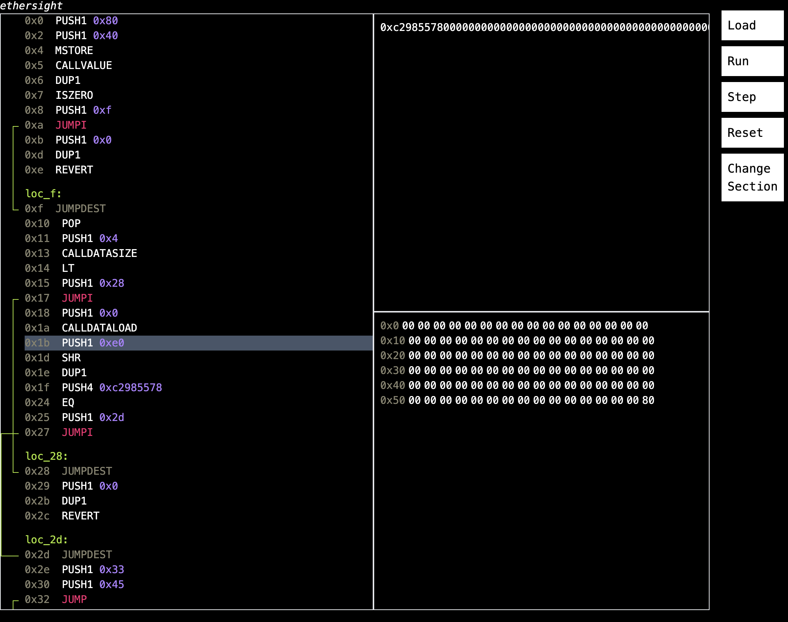

# Ethersight

Ethereum VM (EVM) Debugger.

Provides an execution and debugging environment for EVM Bytecode in a Web GUI.



Goals:

-   Code analysis for bytecode generated from solc
-   Debugging UX designed for real debugging use-cases

TODO:

-   Load Ethereum state from a node (or file)
-   Step backward
-   and more...

## Dependencies

This projects depends on evm-disasm-js (https://github.com/morukutsu/evm-disasm-js) which is not yet published on NPM. At the moment it must be pulled manually and linked using "npm link". This will be fixed soon.

## Usage

As the project evolves, the install steps will be simplified.

### 0. Install dependencies

```
git clone https://github.com/morukutsu/evm-disasm-js.git
cd evm-disasm-js
npm link

cd backend
npm install
npm link evm-disasm-js # TODO: remove this

cd frontend
npm install
```

### 1. Config file

Instances of the debugger are created using config files, for example:

```
{
    "bytecode": {
        "file": "sample_bytecode.hex"
    },
    "runtime": {
        "calldata": "0xc2985578000000000000000000000000"
    }
}
```

### 2. Run the debugger

Use the script to start the debugger:

```
./start-ethersight.sh input.json
# Open browser to http://localhost:3000
```
